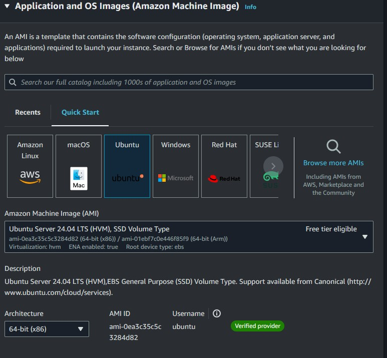

# How to create an EC2 Instance Using Terraform
## What is this?
Terraform can be used to create instances using its different aspects of code. Learning about these different parts will benefit anyone who seeks to learn the intricacies of Infrastructure as Code.

The tutorial will be grouped into sections for each part of the terraform files. It is recommended to use VSCode to keep the syntax neat and formatted.

## Objective
You will be able to break down Terraform files in their respective parts and create an EC2 instance from your local terminal.

## Links
_Note: Links for Terraform documentation will be included in their appropriate tutorial sections below, rather than in this section._

## Vocabulary 

## Commands

```terraform init```: Starts up your terraform project.

```terraform plan```: Shows you what your terraform resources are, within your configuration file.

```terraform fmt```: Fixes formatting or syntax issues.

```terraform apply```: Applies the terraform resources in your configuration files.

```terraform show```: Shows what resources are present and applied.

```terraform destroy```: Deletes and destroys anything that terraform applied earlier.

## 1. Providers.tf File
The providers section and subsequent providers.tf file tells Terraform what application to communicate with. In our case, it will be AWS. You can also access the link for the AWS Provider Documentation here.

[AWS Provider Documentation](https://registry.terraform.io/providers/hashicorp/aws/latest/docs)


On line 1-3, Terraform asks for the required provider. As we mentioned before, it would be AWS. 
On line 4, we put the source as hashicorp/aws. This is also referenced in the Provider Documentation example. Please take a look.

_Notice on lines 1, 2, and 3, there are brackets open to the right, and then enclosed by square brackets in line 5, 6, and 7. It is very important to close them, as leaving them open will give an error output later. Likewise, quotation marks are needed for any content, including those within brackets._

On line 9, we get to the provider details section. "aws" is the listed provider since we are using AWS with Terraform.
In Line 10, this is the region. If you remember from your AWS console, you chose a region to start. When you go to your AWS Dashboard, next to your name on the top right, there should be a region listed, with its appropriate region code in the drop down. In the picture, us-east-2 refers to Ohio.
For Line 11, a shared_credentials_file is asking where your AWS credentials are stored within your local computer. In this example, it's inside the .aws directory under the credentials file. (This particular section needs square brackets since it is showing the path to the file.)
The profile part of this is asking what profile is going to access AWS. Run ```aws sts get-caller-identity``` to check which profile you are on. The example states that the profile is "user."
Lastly, the final bracket on line 13 closes off what line 9 started.

### Steps for Providers.tf File
1. Create a working directory for your Terraform configuration. For example, ```mkdir EC2Terraform```
2. Swap over to that directory. ```cd EC2Terraform```
3. Create a providers.tf file, and ```nano providers.tf```
3. Copy paste the formatting from the example and change appropriate information.
4. Save the file in that directory.

## 2. Datasources.tf File
The data sources file in our example shows what kind of distribution we want for our EC2 instance. You can take a look at the documentation for data sources below.

[data sources Documentation](https://registry.terraform.io/providers/hashicorp/aws/latest/docs/data-sources/ami)


In line 1, the data section goes over where the ami (Amazon Machine Image) comes from, and that it is designated as a server.
Line 2 tells us that the ami would be the most recent or updated version; hence the label equaling true. If it wasn't the most recent it would be noted as false.
Line 3 shows the owner of the AMI. To find the owner of an AMI, you need to go to launch instances within your EC2 Dashboard in the AWS console. It will show you the AMI ID once you have Ubuntu selected, as shown below.



Once you have the AMI ID copied, click "AMI" on the left toolbar. It will take you to the AMI search function. Make sure the drop down is set at "Public Images", then paste the AMI ID you have into the search bar. From there, the Owner number will be visible.

As shown in the example for owners, you'll find the owner ID to input in your datasources.tf file.


Under line 5 onwards, the filter section can specifically identify the version of the Ubuntu. Within the picture you see above, there's a section called AMI name that you can click to find the "values" part of line 7. 

### Steps for Datasources.tf file
1. Within your working directory where you have your providers.tf file, ```touch datasources.tf```.
2. ```nano datasources.tf```
3. Copy paste the formatting of the example datasources.tf found within this project folder.
4. Go to your AWS Console and click Launch Instance after choosing Instance.
5. Copy the AMI ID after selecting Ubuntu.
6. Paste the AMI ID into the AMI search bar after going back and clicking AMI on the left toolbar. Don't forget to have public images set as a filter.
7. Copy the owner number and paste it into the owners section of your datasources.tf file.
8. Click on the AMI again to find the details. Copy the AMI Name information, but replace the numbers after the last dash with a * instead. This will allow the newest updated version of this AMI to be used, as you see in the example from before.


9. Save your datasources.tf file.


